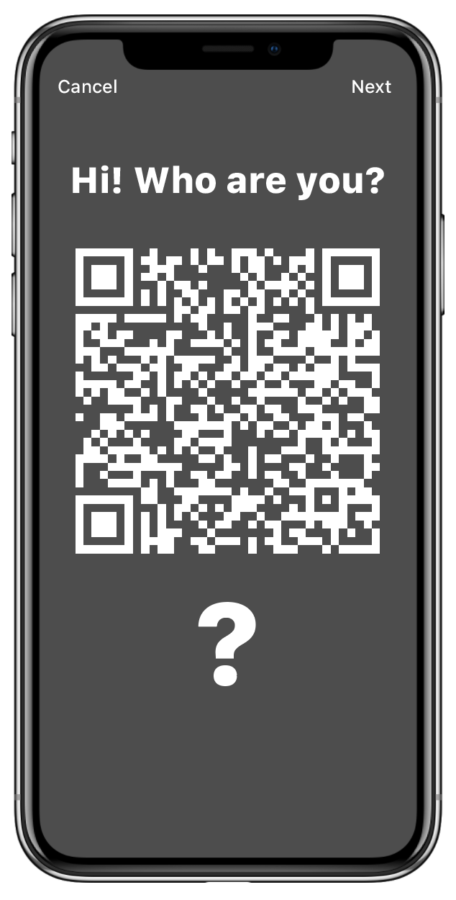
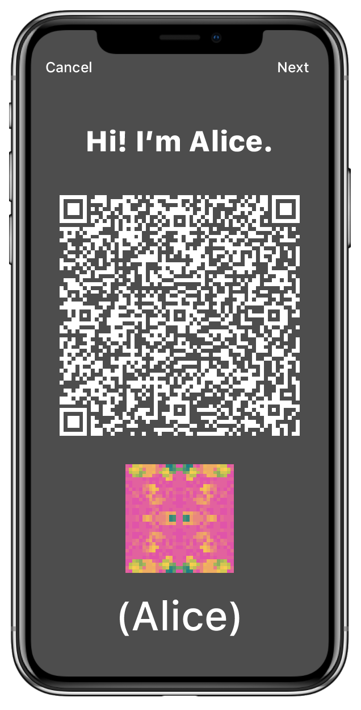
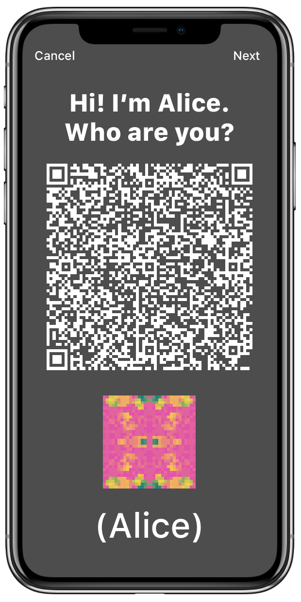
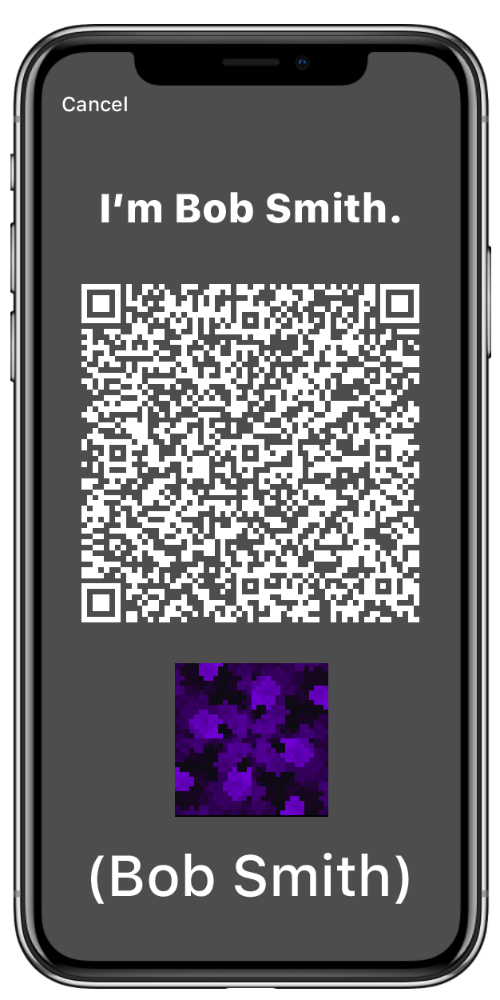

# Secure Crypto-Wallet Introductions

**Authors:** Wolf McNally, Ryan Grant

## Abstract
Parties meeting in person have an opportunity to verify DIDs by exchanging challenges in QR-codes, and completing DID Authentications to create a secure Rolodex.  Due to meeting in person, the parties are not limited to using a widely-published (persistent) DID; they may create ephemeral identities on which they later reveal personal details. The goal of this position paper is to show an in-person contact exchange, and explore the basic user experience on which additional Verifiable Credential features may be attached. For simplicity, public/private keys are used to explain, rather than DIDs.

## Problem Definition 
Existing smartphone contact database tools use federated identity (Facebook or Google+ signon, an email address which is usually from a major email provider, or a phone number).  Even an email address to a custom domain is not ultimately owned by the user.  Users can create static vCard contacts which they fully own, but these are not updateable, unlike the “about” pane in Twitter and Facebook.  P2P messaging apps like Signal and WhatsApp offer “verified safety numbers” to prove that there is no Man-in-the-middle, but these are particularly restrictive on identity, requiring a phone number attached to a national system.  

What is wanted is a contact-adding interaction that:

* uses an identity generated without relying on any authority, 
* shares easily in person with another smartphone user,
* completes without anyone looking at any cryptographic strings,
* verifies identity control for all parties transmitting contacts,
* offers DID Document updates that can be discovered later online, and
* provides a sound base for exchanging other verifiable credentials. 

## Use Case
Alice and Bob meet in person. Each is carrying a smart phone on which they have a crypto-wallet app they use for storing their identities and the identities of others they know. Unlike a typical address book, each identity is associated with a key. Their own identities (of which they each may have several) each contains a private key which only they have. The private key allows them to prove their identity to others. Their crypto-wallet also contains the public keys of those they have met, possibly with other associated information they have added.

Alice and Bob wish to securely share their public keys and proposed names (called “nicknames” in [PetnameIntro]) with each other in such a way that each knows the other must own the private key associated with the public key they receive.

## Recognizing Identities
How can this work from a user-interface perspective? What functions must this minimal crypto-wallet provide for the secure exchange of (possibly ephemeral) identities?

Since it is important that Alice not confuse Bob with any other “Bob” she knows or someone later trying to impersonate Bob, a system of fingerprints and petnames is proposed. Fingerprints are highly-recognizable images that are unlikely to be visually similar when comparing two of them side-by-side. Petnames are names given to the key by receiver, and must be unique. Whenever an identity is displayed within the crypto-wallet, it is always displayed as the fingerprint and the petname. The petname can be changed by the receiver at will depending on what the receiver finds memorable and useful in the relationship— the fingerprint never changes.

### Fingerprints and Introducing LifeHash
Visual cues, regarding which party one is dealing with, mimic the comfort of recognizing a face. The prior art includes various schemes using some identifier to seed a visual representation. For prior examples see [HashVisualization] and [AvatarsAndIdenticons].

Wolf McNally has developed and proposes a new open-source algorithm called LifeHash [LifeHash] for visually representing the public key, based on the Conway’s Game of Life cellular automata.

The goal of the algorithm is to create icons that are deterministic, yet distinct and unique given the input data, as well as aesthetically pleasing.

The basic method is to take a SHA256 hash of the input data (which can be any data including another hash) and then use the 256-bit digest as a 16x16 pixel "seed" for running the cellular automata known as Conway’s Game of Life [ConwaysLife]. 

After the pattern becomes stable (or begins repeating) the resulting history is used to compile a grayscale image of all the states from the first to last generation. Using Game of Life provides visual structure to the resulting image, even though it was seeded with entropy. Because 16^2 == 256, every bit of the SHA256 hash is used in the seed, and every generation of the cellular automata makes a difference in the resulting visual hash.

Some bits of the initial hash are then used to deterministically apply symmetry and color to the icon to increase beauty and quick recognizability. See [LifeHash] for more examples and source code.


Figure 1. Examples of LifeHash

### Petnames
[ZookosTriangle] posits that names cannot be at the same time global, securely unique, and decentralized. [PetnamesIntro] describes petnames as securely unique and decentralized, but not global:

> Petnames are our private bidirectional references to keys. There are many Mark Millers, but there is one specific Mark Miller that the name means to me, the Mark Miller who works with object-capabilities for secure cooperation. "Mark Miller" is Mark Miller's nickname **(“proposed name” in this document)**; it also happens to be my petname for the same individual. My private pet name for my wife is not recognizably similar to the public nickname used by my wife. In the computer setting, for a specific person with a specific application, petnames are unique, each petname refers to exactly one key, and each key is represented by exactly one petname. In all places in the application where the app wants to designate the key, the petname is displayed -- which is to say, a true petname is a bidirectional one-to-one mapping to a key. All references to the key by the user interface are represented by petname. A key cannot have two petnames; if a single key had two petnames, under what circumstances would the user interface use petname1 as the representation of the key, and under what circumstances would it bring up petname2?

Once received, the key is then assigned a petname by the receiving party. Until this happens the key is identified by the fingerprint and an “UNTRUSTED” name with the proposed name of the sender in parentheses.


Figure 2. Alice’s key before assigning a petname

This petname is unique within the crypto-wallet, so although Alice can call Bob’s key “Bob”, there can only be one “Bob” in Alice’s wallet. Similarly, if there is already an “Alice” in Bob’s wallet, Bob will need to pick a more unique name such as “Alice Jones” or “Alice from Joe’s party” for Alice’s petname to distinguish her from the pre-existing “Alice”. Solutions for how to handle petnames that may be confusingly similar are discussed in the literature, but in general it is up to the wallet owner to choose petnames that meaningfully bring to mind the role of the sender in their life. Petnames can be changed over time as this role evolves.


Figure 3. Alice’s key after assigning a petname

Throughout the app, colors and fonts are used as a convention to indicate the status of an identity. Bob’s view of his own private keys in his wallet show the fingerprints for his public keys along with both his own petnames for his own keys (which are not shared) and his proposed names for each (in parentheses.) These are displayed in bold font and in green. Bob may find it useful to choose petnames that reflect his life role associated with that key, but proposed names that reflect how he would like to be known.

Note also the convention of always showing proposed names in parentheses, both for private keys owned by a sender and received public keys.


Figure 4. Bob’s view of his own private keys.

## Exchange Procedures
Typically two parties meeting in person will want to exchange their public keys. The outline for transmitting Alice’s key to Bob are as follows:

1. Alice selects one of her identities to share with Bob.
2. Bob sends a request-for-identity message to Alice, which includes a random string as a challenge (so Alice can prove she owns the private key Bob will be receiving.)
3. Alice receives Bob’s request, and returns a message containing her public key, proposed name, and Bob’s random challenge, signed by her private key.
4. Bob receives Alice’s message, verifies the signature, and adds Alice’s identity to his wallet.
5. Bob assigns his petname to the public key he just received.

In physical space, this could look like the following.

1. Bob holds up a request QR code, which Alice scans with her camera.
2. Alice holds up a response QR code, which Bob scans with his camera.

A common use-case is Alice and Bob both wish to exchange keys. Rather than have to perform the above steps twice, one additional step can suffice:

1. Bob holds up a request QR code, which Alice scans with her camera.
2. Alice holds up a QR code containing both her response and her own request, which Bob scans with his camera.
3. Bob holds up a response QR code, which Alice scans with her camera.

Encoded as JSON, a request-for-identity might look like this:

```JSON
{
	"type": "IdentityRequest",
	"challenge": "c82d1db4c4c2be4ee11815c1260de15193d5b83c4b430f3a"
}
```

And be presented like this:



Figure 5. Bob’s request to Alice

Alice’s response is also JSON:

```JSON
{
	"type": "IdentityResponse",
	"publicKey": "026faef965fcbce6ab3df4d881481e0cf578246710fb99187697df8bcba3d2a058",
	"proposedName": "Alice",
	"challenge": "c82d1db4c4c2be4ee11815c1260de15193d5b83c4b430f3a",
	"signature": "H6F4CXKQOaiTfDT93fOaX8/5PEZZA+pfWXRa0Olws/jnC887x7HFgjv/7r95dmTPPo60fRCyWuxIkzXURFULNNU="
}
```

It’s signature is formed by signing the concatenation:

	publicKey || challenge || proposedName (UTF-8)

DID-Auth [DIDAuth] provides a standardized way to verify ownership of DIDs, but is more complicated than the above barebones example. This document uses public/private key pairs for simplicity of explanation and implementation of a software proof-of-concept.

Signatures might be presented like this:



Figure 6. Alice’s response to Bob

The above is all that’s needed to send a public key one way, and have Alice prove to Bob that she controls the private key associated with the identity.

If Alice and Bob want to fully exchange keys, then Alice can include her own challenge with her response.

```JSON
{
	"type": "IdentityResponseRequest",
	"publicKey": "026faef965fcbce6ab3df4d881481e0cf578246710fb99187697df8bcba3d2a058",
	"proposedName": "Alice",
	"challenge": "c82d1db4c4c2be4ee11815c1260de15193d5b83c4b430f3a",
	"signature": "H6F4CXKQOaiTfDT93fOaX8/5PEZZA+pfWXRa0Olws/jnC887x7HFgjv/7r95dmTPPo60fRCyWuxIkzXURFULNNU="
}
```

It can be displayed this way:



Figure 7. Alice’s Response/Request back to Bob.

Bob now creates the same sort of response, containing his public key and signed with his private key:

```JSON
{
	"type": "IdentityResponse",
	"publicKey": "0298e1b791e33200001b5eb457e162d88f01ebee6ca1526ba2da7f49bfc92e30b3",
	"proposedName": "Bob Smith",
	"challenge": "8c01711683ce69bb706235f322b62d0172cc0007b0ec93c1",
	"signature": "IJRQrUeeOfCdtCAGVQepYdEfciWfxAC7q3eMBdcaDgVySrsutTKMP5bm6DbHKsjm7TMhms2CND9nyHN8FxoHXSo="
}
```



Figure 8. Bob’s response back to Alice.

Alice scans this final response and the keys are fully exchanged.

This procedure can be further abbreviated:

1. Bob and Alice simultaneously hold their devices up to each other. The screens face each other and the front-facing cameras are used to scan. Each screen contains the party’s request QR code and an inset containing video coming in from the camera. This allows Bob (viewing the front of Alice’s device) to align his viewfinder while Alice’s view of Bob’s device allows her to do the same.
2. Each device emits a tone to indicate receipt of the request and displays the response.
3. Each device then scans for the response and emits a second tone when the response is received.

So in quick succession, each device reads:

1. “Hi! Who are you?” “Hi! Who are you?”
2. “I’m Alice.” “I’m Bob Smith.”

And the exchange is complete.

## References
* [ZookosTriangle] [Zooko’s Triangle, Wikipedia](https://en.wikipedia.org/wiki/Zooko's_triangle)
* [PetnameIntro] [An Introduction to Petname Systems, Marc Stiegler, 2005](http://www.skyhunter.com/marcs/petnames/IntroPetNames.html)
* [LifeHash] [LifeHash on GitHub, Wolf McNally, 2018](https://github.com/wolfmcnally/LifeHash)
* [ConwaysLife] [Conway’s Game of Life, Wikipedia](https://en.wikipedia.org/wiki/Conway's_Game_of_Life)
* [HashVisualization] [Hash Visualization􏰁 a New Technique to improve Real􏰀-World Security, Perrig & Song, 1999](http://www.netsec.ethz.ch/publications/papers/validation.pdf)
* [AvatarsAndIdenticons] [Avatars, identicons, and hash visualization, Jussi Judin, 2018](https://barro.github.io/2018/02/avatars-identicons-and-hash-visualization/)
* [DIDAuth] [Introduction to DIDAuth, Markus Sabadello et al, 2018](https://github.com/WebOfTrustInfo/rebooting-the-web-of-trust-spring2018/blob/master/final-documents/did-auth.md)

## Related Reading
* [Verifiable Displays, Kim Hamilton Duffy et al, 2018](https://github.com/WebOfTrustInfo/rwot7/blob/master/topics-and-advance-readings/verifiable_displays.md)
